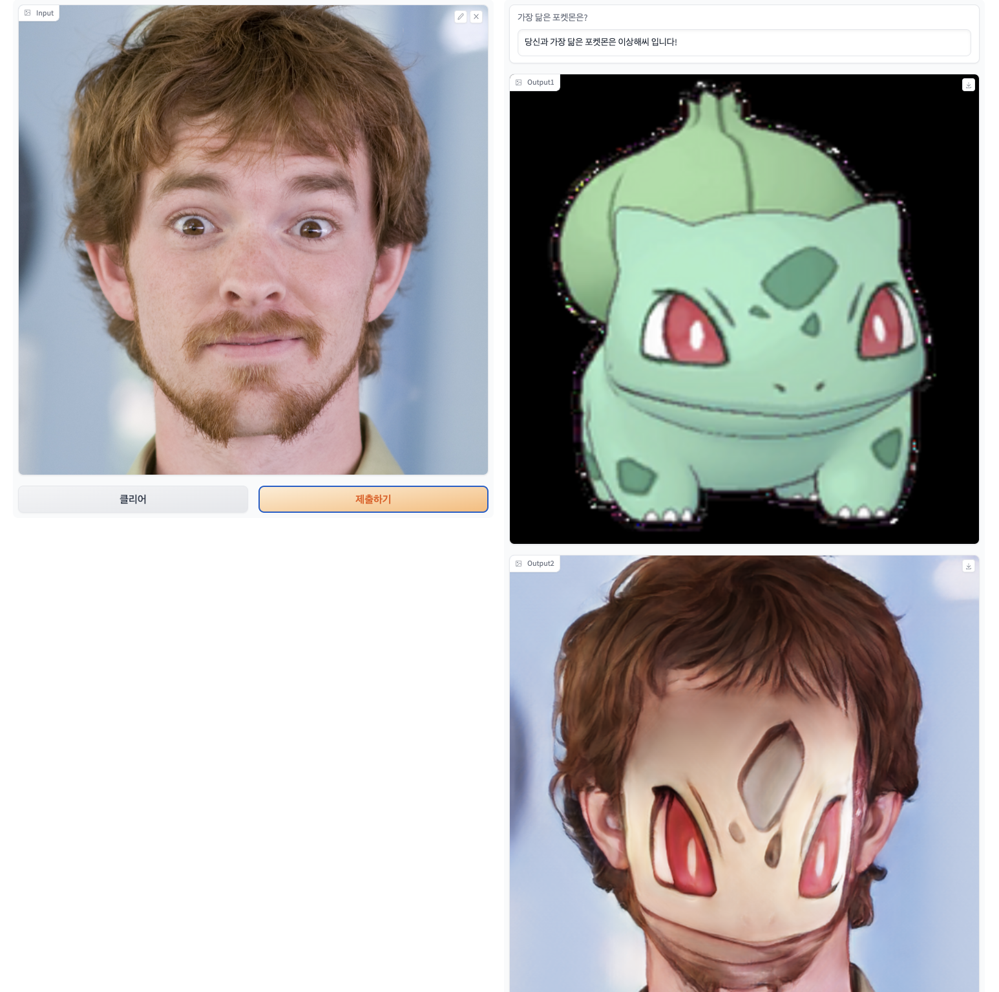

# Pokemon Face Synthesis
The Pokemon Face Synthesis project aims to find the most similar Pokemon when provided with a human face image and then generate a synthesized image that combines the features of both the Pokemon and the human face. By leveraging computer vision techniques and deep learning algorithms, this project explores the fascinating intersection between human facial recognition and the imaginative world of Pokemon. Additionally, the synthesized image is enhanced using the Animagan2 to improve its quality and visual appeal.


## Features
- Human Face to Pokemon Matching: Given a human face image as input, the project identifies the Pokemon that closely resembles the facial features of the individual.
- Pokemon and Human Face Synthesis: The project generates a synthesized image by combining the identified Pokemon with the human face, creating an intriguing hybrid representation.
- Animagan2 Image Enhancement: The synthesized image is further processed using the Animagan2 to improve its visual quality and aesthetics.

## Installation
1. Clone the repository:
```shell
git clone https://github.com/hunsii/pokemon.git
```

2. Install the required dependencies:
```shell
pip install -r requirements.txt
```

3. Download face landmark model from google mediapipe.
```shell
wget -O face_landmarker_v2_with_blendshapes.task -q https://storage.googleapis.com/mediapipe-models/face_landmarker/face_landmarker/float16/1/face_landmarker.task
```

## Usage
If you have web cam, run demo file for webcam.
```python
python demo_webcam.py
```

If you don't have web cam, run demo file for file.
```python
python demo_file.py
```

## Results
Demo image



